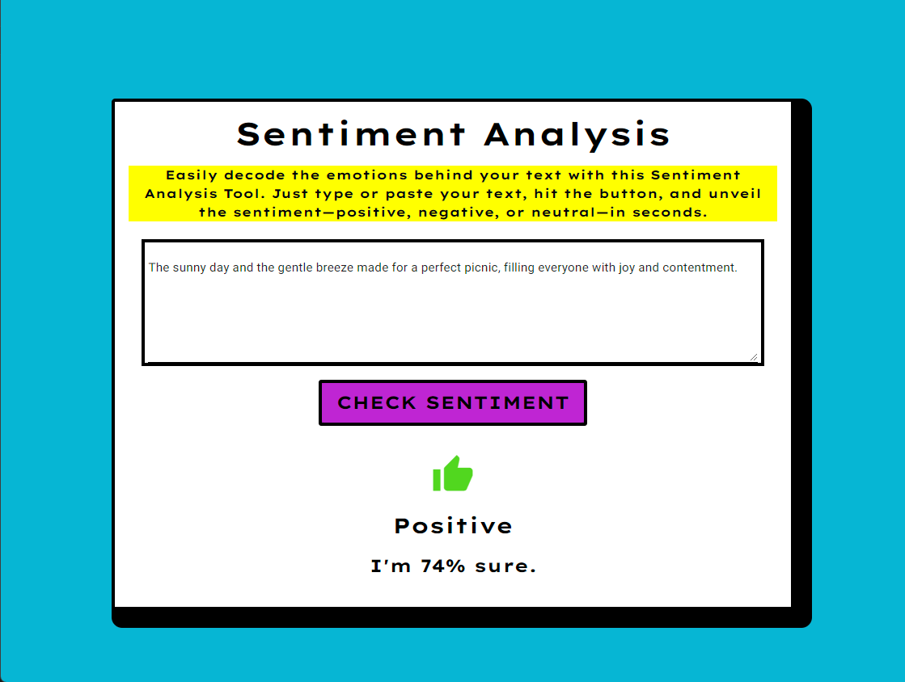

# Sentiment Analysis Web App

|Positive example|Negative example|
:-------------------------:|:-------------------------:
  |  

Hey there! I wanted to share a little project I've been working on: a straightforward sentiment analysis tool. It's a simple web app that analyzes the sentiment of any text you throw at it, showing not just the result but also how confident it is with that judgment, in percentage form. I wanted to use a neo-brutalism inspired design since I have come to love it.

## What's Under the Hood

- **Frontend Fun**: The app's interface is powered by `NiceGUI`. It's a cool library that makes it super easy to put together web UIs with Python. I chose it for its simplicity and because it let me focus on the functionality rather than the design details.
- **AI Magic**: For the sentiment analysis, I'm using the Hugging Face Transformers library. The star of the show is the `distilbert-base-multilingual-cased-sentiments-student` model by Lik Xun Yuan. It's a mouthful, I know, but it's a fantastic model that understands multiple languages and does a pretty solid job of figuring out sentiments.
- **Check It Out**: Lik Xun Yuan. (2023). `distilbert-base-multilingual-cased-sentiments-student` (Revision 2e33845). You can find more about it on the [Hugging Face Model Hub](https://huggingface.co/lxyuan/distilbert-base-multilingual-cased-sentiments-student).

## How This Thing Works

1. **Launch**: Fire up the app, and it'll pop open in your default web browser. You'll find it sitting at `localhost:8080`. If this is your first time running the app, it will download the model from Hugging Face.
2. **Paste and Go**: There's a textbox waiting for you. Drop any text you're curious about into it. Could be a tweet, a quote, a random thought - anything, really.
3. **See What It Thinks**: Click the button and give it a moment. It'll come back with whether it thinks the sentiment is positive, negative, or neutral, along with how confident it is in that call, shown as a percentage.

## Getting Started

If you want to play around with this or maybe tweak it into something of your own, here's how to get it running:

1. **Grab the Code**: Clone or download this repo to a spot you like on your computer.
2. **Dependencies**: You'll need some Python libraries. Run `pip install -r requirements.txt` to get them.
3. **Run It**: Just type `python app.py` in your terminal, and the app should start up and open in your browser.

## License

This project is under the Apache 2.0 License. Feel free to use it, modify it, and share it as you like.

## Tested versions
Python 3.8

Hope you find this tool interesting or useful. Have fun playing around with it!
